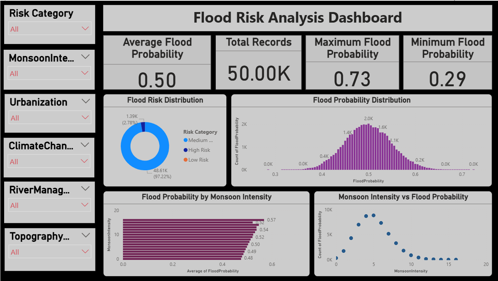

# Flood Risk Analysis using Python and Power BI

## Project Overview

Floods are one of the major natural hazards that can cause significant damage to people, infrastructure, agriculture, and the environment.

This project analyzes flood-related factors using **Python** and presents the findings through an interactive **Power BI dashboard**.

The analysis focuses on identifying patterns and factors associated with **Flood Probability** using exploratory data analysis, correlation analysis, and data visualization.


## Objectives

* Analyze a flood risk dataset containing 50,000 records.
* Understand the distribution and characteristics of the dataset.
* Check for missing values and duplicate records.
* Analyze relationships between flood-related factors.
* Identify factors correlated with Flood Probability.
* Create visualizations using Python.
* Build an interactive Power BI dashboard.
* Present meaningful insights from the analysis.


## Dataset

The dataset contains **50,000 records and 21 columns**.

### Target Variable

* `FloodProbability`

### Features

* MonsoonIntensity
* TopographyDrainage
* RiverManagement
* Deforestation
* Urbanization
* ClimateChange
* DamsQuality
* Siltation
* AgriculturalPractices
* Encroachments
* IneffectiveDisasterPreparedness
* DrainageSystems
* CoastalVulnerability
* Landslides
* Watersheds
* DeterioratingInfrastructure
* PopulationScore
* WetlandLoss
* InadequatePlanning
* PoliticalFactors
* FloodProbability


## Technologies Used

### Programming

* Python

### Python Libraries

* Pandas
* NumPy
* Matplotlib
* Seaborn

### Visualization & Business Intelligence

* Power BI
* Power Query
* DAX

### Environment

* Google Colab

### Version Control

* GitHub


## Python Data Analysis

The Python notebook includes the following analysis:

### 1. Data Loading

The dataset was loaded using Pandas.

```python
import pandas as pd

df = pd.read_csv('flood.csv')
```

### 2. Dataset Exploration

The dataset was examined using:

* Dataset shape
* Column names
* Dataset information
* Descriptive statistics

### 3. Missing Value Analysis

Missing values were checked for each column.

```python
df.isnull().sum()
```

### 4. Duplicate Analysis

Duplicate records were identified using:

```python
df.duplicated().sum()
```

### 5. Correlation Analysis

A correlation matrix was created to understand relationships between numerical variables.

```python
correlation_matrix = df.corr()
```

### 6. Correlation Heatmap

A heatmap was created using Seaborn to visually analyze correlations between variables.

### 7. Flood Probability Distribution

The distribution of `FloodProbability` was analyzed using a histogram with KDE.

### 8. Outlier Detection

Boxplots were used to examine the distribution and potential outliers across the dataset.

### 9. Feature Correlation with Flood Probability

The correlation of each feature with `FloodProbability` was calculated and sorted.

```python
corr_target = df.corr()['FloodProbability']
corr_target = corr_target.sort_values(ascending=False)
```

### 10. Top Factors

The analysis identifies the features with the highest correlation with `FloodProbability`.

### 11. Pairplot Analysis

A sample of 500 records was used to visualize relationships between selected variables:

* MonsoonIntensity
* TopographyDrainage
* RiverManagement
* FloodProbability


## Power BI Dashboard

The Power BI dashboard provides an interactive view of the flood risk data.

### Dashboard Features

* Flood Probability analysis
* Flood-related factor analysis
* Interactive visualizations
* KPI cards
* Filters and slicers
* Comparative analysis of different factors

### Dashboard Preview




## Key Analysis Areas

The project focuses on understanding how factors such as:

* Monsoon Intensity
* Topography Drainage
* River Management
* Urbanization
* Climate Change
* Deforestation
* Drainage Systems
* Coastal Vulnerability
* Infrastructure
* Wetland Loss

are associated with flood probability in the dataset.


## Project Structure

```text
Flood-Risk-Analysis/
│
├── data/
│   └── flood_risk_dataset.csv
│
├── notebooks/
│   └── Flood_Risk_Analysis.ipynb
│
├── powerbi/
│   └── Flood_Risk_Analysis.pbit
│
├── images/
│   └── flood_risk_dashboard.png
│
└── README.md
```

---

## How to Run the Python Analysis

### Step 1: Clone the repository

```bash
git clone https://github.com/your-username/Flood-Risk-Analysis.git
```

### Step 2: Open the notebook

Open:

```text
notebooks/Flood_Risk_Analysis.ipynb
```

using:

* Google Colab
* Jupyter Notebook
* JupyterLab

### Step 3: Load the dataset

Use the dataset available in:

```text
data/flood_risk_dataset.csv
```

### Step 4: Run the notebook

Run the cells sequentially to reproduce the analysis.


## Power BI Report

The Power BI report is available in:

```text
powerbi/Flood_Risk_Analysis.pbit
```

Open the `.pbit` file using Microsoft Power BI Desktop.


## Project Outcome

This project demonstrates practical skills in:

* Data Cleaning
* Exploratory Data Analysis
* Statistical Correlation Analysis
* Data Visualization
* Python
* Pandas
* NumPy
* Matplotlib
* Seaborn
* Power BI
* Dashboard Development
* Data Storytelling


## Author

**Shruti Ajit Khurpe**

B.Sc. Data Science


